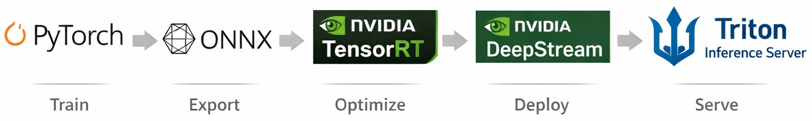

# Computer Vision
Welcome to the GitHub repository for the Computer Vision course at Yachay Tech University. This repository is designed to provide you with hands-on experience and in-depth understanding of fundamental deep learning-based artificial perception topics. The repository includes both coding exercises and project-based activities, and were created using Python 3.x as the interpreter.

## Getting Started
1. Clone this repository to your local machine:  

   ```
   git clone https://github.com/eugeniomorocho/Computer_Vision.git
   ```

2. Navigate to the specific Notebook's directory:  

   ```
   cd Computer_Vision/<folder>/<notebook.ipynb>/
   ```
   
3. Follow the instructions in the file for each week's lab.

4. To update your local fork to the newest commit, execute:

   ```
   git fetch 
   ```

## Requirements

- `Python 3.x` as the interpreter
- Additional dependencies specified in each week's lab instructions
- Create a [GitHub](https://github.com) repository for submitting your assignments and add `@eugeniomorocho` as collaborator.

## Minimum Contents

- Image formation, image processing, feature extraction, segmentation, computational photography, 3D reconstruction, and object
detection and recognition.

## Learning Outcomes

- Process data from visual representations, images, and video to extract information. Classify images and extract features.

## Course Contents

### **Unit 1: Foundations of Computer Vision & Convolutions**

**Topics:**

History of computer vision, modern computer vision, images as tensors, image filtering and convolution, understanding visual features.  

**Slides:**  

Unit 1: Foundations of Computer Vision & Convolutions  

[](https://www.canva.com/design/DAG9kh3-RYE/s26i4QoK_D1lUX510QcoZQ/view?utm_content=DAG9kh3-RYE&utm_campaign=designshare&utm_medium=link2&utm_source=uniquelinks&utlId=he981cdd10d)

**Notebooks:**  

1. Images as tensors  
[](https://github.com/eugeniomorocho/Computer_Vision/blob/main/UC.01%20Introduction%20to%20Computer%20Vision/1.%20Images%20as%20tensors.ipynb)

2. Image filtering and convolution   
[](https://github.com/eugeniomorocho/Computer_Vision/blob/main/UC.01%20Introduction%20to%20Computer%20Vision/2.%20Filters%20and%20convolution.ipynb)

3. Filters in OpenCV  
[](https://github.com/eugeniomorocho/Computer_Vision/blob/main/UC.01%20Foundations%20of%20CV%20%26%20Convolutions/3.%20Filters%20in%20openCV.ipynb)

**Assignments:**  

- *Lab 01:* Classification with Filters  
[](https://github.com/eugeniomorocho/Computer_Vision/blob/main/UC.01%20Foundations%20of%20CV%20%26%20Convolutions/Lab%2001%3A%20Classification%20with%20filters.ipynb)

- *DataCamp* course: [Image Processing in Python](https://app.datacamp.com/learn/courses/image-processing-in-python)

**Aditional Readings:**

- **Chapter 15: Linear Image Filtering** Torralba, A., Isola, P., & Freeman, W. (2024). *Foundations of Computer Vision*. MIT Press. https://visionbook.mit.edu/

**Tools:**  

[Python](https://www.python.org), [NumPy](https://numpy.org), [OpenCV](https://opencv.org), [PyTorch](https://pytorch.org)

**Datasets:**  

- [MNIST](https://www.tensorflow.org/datasets/catalog/mnist), *National Institute of Standards and Technology (NIST)*, Department of Commerce, U.S.  
- [CIFAR10](https://www.cs.toronto.edu/~kriz/cifar.html), *Department of Computer Science*, University of Toronto.

---

### **Unit 2: CNNs for Image Classification**

**Topics:** Neural networks for vision, convolutional layers, pooling, training pipeline (forward inference and backpropagation), evaluation metrics, overfitting, regularization.

**Slides**
Unit 2: CNNs for Image Classification  

*Part 1:* [](https://www.canva.com/design/DAHBCVJ9lNs/RfBVZ-nWvwQ-uUc-0mdRaQ/view?utm_content=DAHBCVJ9lNs&utm_campaign=designshare&utm_medium=link2&utm_source=uniquelinks&utlId=hee360a69b2)  

*Part 2:* [](https://www.canva.com/design/DAHBIXVGh88/-l46ADjHryNSzPaFbEJF6A/view?utm_content=DAHBIXVGh88&utm_campaign=designshare&utm_medium=link2&utm_source=uniquelinks&utlId=h4e90a6867d)  

**Tools:** [PyTorch](https://pytorch.org)  

**Datasets:**  
[CIFAR10](https://www.cs.toronto.edu/~kriz/cifar.html), *Department of Computer Science, University of Toronto* 

**Notebooks:**  

1. Train a CNN for image classification with PyTorch  
[](https://github.com/eugeniomorocho/Computer_Vision/blob/main/UC.02%20CNNs%20for%20Image%20Classification/1.%20Train%20a%20CNN%20for%20image%20classification%20with%20PyTorch.ipynb)

**Assignments:**  
- *Lab 02:* Create your own CNN  
[](https://github.com/eugeniomorocho/Computer_Vision/blob/main/UC.02%20CNNs%20for%20Image%20Classification/Lab%2002%3A%20Image%20classifier.ipynb)  
- *DataCamp* course: [Introduction to Deep Learning with PyTorch](https://app.datacamp.com/learn/courses/introduction-to-deep-learning-with-pytorch)  

**Aditional Readings:**

- **Chapter 3: Building a Deep Neural Network with PyTorch** Ayyadevara, V. K., & Reddy, Y. (2024). *Modern Computer Vision with PyTorch: A practical roadmap from Deep Learning fundamentals to advanced applications and Generative AI (2nd ed.)*. Packt Publishing Ltd. https://www.packtpub.com/en-mt/product/modern-computer-vision-with-pytorch-9781803240930

- **Get Started locally with PyTorch:** https://pytorch.org/get-started/locally/

- **Defining a Neural Network in PyTorch:** https://docs.pytorch.org/tutorials/recipes/recipes/defining_a_neural_network.html

- **PyTorch Recipes:** https://docs.pytorch.org/tutorials/recipes_index.html

- **PyTorch Tutorials:** https://docs.pytorch.org/tutorials/ 

---

### **Unit 3: Transfer Learning & Model Improvement**

**Topics:**

 CNN architectures, pretrained weights, pretrained CNNs, transfer learning, data augmentation,  fine-tuning and model improvement.

 **Slides**
Unit 3: CNNs for Image Classification

*Part 1:* [](https://github.com/eugeniomorocho/Computer_Vision/blob/main/UC.03%20Transfer%20Learning%20%26%20Model%20Improvement/Lab_03-Model_Improvement.ipynb)  

**Notebooks:**

1. Transfer learning for Computer Vision in Keras  
[](https://github.com/eugeniomorocho/Computer_Vision/blob/main/UC.03%20Transfer%20Learning%20%26%20Model%20Improvement/Image%20classification/Clasificacion_imagenes_perros_gatos_VGG-16_transfer_learning.ipynb)

2. Transfer learning for Computer Vision in PyTorch  
[](https://docs.pytorch.org/tutorials/beginner/transfer_learning_tutorial.html)

**Assignments:**  

- *Lab 03:* Model Improvement  
[](https://github.com/eugeniomorocho/Computer_Vision/blob/main/UC.03%20Transfer%20Learning%20%26%20Model%20Improvement/Lab_03-Model_Improvement.ipynb)

**Aditional Readings:**

- **Chapter 37: Transfer Learning and Adaptation** Torralba, A., Isola, P., & Freeman, W. (2024). *Foundations of Computer Vision*. MIT Press. https://visionbook.mit.edu/

- **Chapter 5: Transfer Learning for Image Classification** Ayyadevara, V. K., & Reddy, Y. (2024). *Modern Computer Vision with PyTorch: A practical roadmap from Deep Learning fundamentals to advanced applications and Generative AI (2nd ed.)*. Packt Publishing Ltd. https://www.packtpub.com/en-mt/product/modern-computer-vision-with-pytorch-9781803240930

- **Transfer learning or fine-tuning of a model** Shanmugamani, R. (2018). *Deep Learning for Computer Vision: Expert techniques to train advanced neural networks using TensorFlow and Keras (1st ed.)*. Packt Publishing Ltd. https://www.packtpub.com/en-us/product/deep-learning-for-computer-vision-9781788295628

- **PyTorch Models and Pre-trained Weights:** https://docs.pytorch.org/vision/stable/models.html

**Tools:**

- [Streamlit](https://streamlit.io)

**Datasets:**

- [Ants vs. Bees](https://download.pytorch.org/tutorial/hymenoptera_data.zip)
- [PyTorch Datasets](https://docs.pytorch.org/vision/stable/datasets.html)

---

### **Unit 4: Object Detection**  
**Topics:** Classification vs detection, bounding boxes & IoU, YOLO architecture, dataset annotation  

**Notebooks:**  
1. Drawing a Bounding Box with OpenCV  
[](https://github.com/eugeniomorocho/Computer_Vision/blob/main/UC.06%20Object%20Detection%20(YOLO%20%2B%20Roboflow)/Object%20Detection/1.%20Drawing%20a%20Bounding%20Box%20with%20OpenCV.ipynb)

2. Real-time Object Detection with YOLO  
[](https://github.com/eugeniomorocho/Computer_Vision/blob/main/UC.06%20Object%20Detection%20(YOLO%20%2B%20Roboflow)/Object%20Detection/2.%20Real-time%20Object%20Detection%20with%20YOLO.ipynb)

3. Custom YOLO Object Detection with Roboflow  
[](https://github.com/eugeniomorocho/Computer_Vision/blob/main/UC.06%20Object%20Detection%20(YOLO%20%2B%20Roboflow)/Object%20Detection/3.%20Custom%20YOLO%20Object%20Detection%20with%20Roboflow.ipynb)

**Resources:**

- [Ultralytics](https://www.ultralytics.com)<br>
- [Roboflow](https://roboflow.com)

**Tools:** Ultralytics YOLO, Roboflow, OpenCV (Bounding Boxes Notebook)  

**Datasets:**  
[Common Objects in Contexr (COCO)](https://cocodataset.org/#home)  

**Notebooks:**  
- Train an object detector on a custom dataset using [Roboflow](https://roboflow.com)  

- [Roboflow tutorial](https://github.com/eugeniomorocho/Computer_Vision/blob/main/UC.04%20Object%20Detection/Object%20Detection/roboflow_tutorial.pdf)

**Assignments:**  
Notebooks 1, 2, and 3.

**Aditional Readings:**
- **Chapter X: Title** Authors (year). Book. Publisher. https://url.com  

---

### **Unit 5: Image Segmentation & Pose Estimation**
**Topics:** Semantic vs instance segmentation, encoder–decoder architectures, human pose estimation basics  

**Tools:** PyTorch, MediaPipe  

**Datasets and Pretrained Models:**  
- [COCO-Pose Dataset - 17 keypoints](https://docs.ultralytics.com/datasets/pose/coco/)  
- [Hand Keypoints Dataset - 21 keypoints, Ultralytics](https://docs.ultralytics.com/datasets/pose/hand-keypoints/)
- [Face Landmark Detection, Mediapipe](https://ai.google.dev/edge/mediapipe/solutions/vision/face_landmarker)
- [Hand Landmark Detection, Mediapipe](https://ai.google.dev/edge/mediapipe/solutions/vision/hand_landmarker)
- [Interactive Image Segmentation, Mediapipe](https://ai.google.dev/edge/mediapipe/solutions/vision/interactive_segmenter)

**Notebooks:** 
1. Pose Estimation with YOLO  
[](https://github.com/eugeniomorocho/Computer_Vision/blob/main/UC.05%20Image%20Segmentation%20%26%20Pose%20Estimation/1.%20Pose%20estimation%20with%20YOLO.ipynb)

2. Image Segmentation  
[](https://github.com/eugeniomorocho/Computer_Vision/blob/main/UC.05%20Image%20Segmentation%20%26%20Pose%20Estimation/2.%20Instance%20segmentation%20with%20YOLO.ipynb) 

**Assignments:**  
- Segmentation **and** pose estimation mini-projects. Instructions and rubric is contained in the lecture notebooks.

**Aditional Readings:**
- **Chapter 11: Image Segmentation** Chollet, F. (2026). Deep Learning with Python (3rd ed.). Manning Publications. https://deeplearningwithpython.io  
- [YOLO Instance Segmentation](https://docs.ultralytics.com/tasks/segment/) 
- [YOLO Pose Estimation](https://docs.ultralytics.com/tasks/pose/) 
---

### **Unit 6: Tracking & Video Analysis**
**Topics:** Detection vs tracking, classical trackers (KCF, CSRT), tracking-by-detection  

**Tools:** OpenCV, Ultralytics  

**Datasets:**  
[PersonPath22](https://amazon-science.github.io/tracking-dataset/personpath22.html)  
[Multiple Object Tracking Benchmark (MOT17)](https://motchallenge.net/data/MOT17/)  

**Notebooks:**  
1. Tracking with KCF, CSRT, and ByteTrack  
[](https://github.com/eugeniomorocho/Computer_Vision/blob/main/UC.06%20Tracking%20%26%20Video%20Análisis/1.%20Tracking.ipynb)  

**Assignments:**  

- *The assignment requirements are included in the lecture notebook.*  

**Aditional Readings:**
- **Chapter 46, 47, 48, 49: Understanding Motion** Torralba, A., Isola, P., & Freeman, W. (2024). Foundations of Computer Vision. MIT Press. https://visionbook.mit.edu/part_understanding_motion.html
- **Multiple Object Tracking in Realtime** Anna Petrovicheva, OpenCV https://opencv.org/multiple-object-tracking-in-realtime/?ref=blog.roboflow.com
- **What is Object Tracking in Computer Vision** Mrinal W, Roboflow https://blog.roboflow.com/what-is-object-tracking-computer-vision/
- **How to Implement Object Tracking for Computer Vision**, Jacob Solawetz, Roboflow https://blog.roboflow.com/what-is-object-tracking-computer-vision/
- **Multi-Object Tracking with Ultralytics YOLO**, Ultralytics documentation https://docs.ultralytics.com/modes/track/
- **State-of-the-Art Real-time Multi-Object Trackers with NVIDIA DeepStream SDK 6.2**, NVIDIA Technical Blog https://developer.nvidia.com/blog/state-of-the-art-real-time-multi-object-trackers-with-nvidia-deepstream-sdk-6-2/

---

### **Unit 7: Model Deployment & Edge AI**
**Topics:** Inference vs training, running models with ONNX runtime, vision model APIs, edge inference and hardware constraints  

**Tools:** GPUs, NVIDIA Jetson Nano

**Datasets:**  
[CIFAR10](https://www.cs.toronto.edu/~kriz/cifar.html), *Department of Computer Science, University of Toronto*  

**Notebooks:**  
1. CPU vs. GPU  
[](https://github.com/eugeniomorocho/Computer_Vision/blob/main/UC.07%20Model%20Deployment%20%26%20Edge%20AI/1.%20CPUvsGPU.ipynb) 

**Assignments:**  
- The assignment is included in the notebook. 

**Aditional Readings:**
- **Recommended Course:** [Getting Started with AI on Jetson Nano](https://learn.nvidia.com/courses/course-detail?course_id=course-v1:DLI+S-RX-02+V2), from the [NVIDIA Deep Learning Institute](https://www.nvidia.com/en-us/training/)  
   
   - Free courses: [Nvidia Deep Learning Institute (free courses)](https://www.nvidia.com/en-us/training/find-training/?Free+Courses=Free)
- [Jetson AI Lab](https://www.jetson-ai-lab.com)
- [NVIDIA Jetson with Ultralitics YOLO26](https://docs.ultralytics.com/guides/nvidia-jetson/)
- [Ultralitics YOLO26 on NVIDIA Jetson using DeepStream SDK and TensorRT](https://docs.ultralytics.com/guides/deepstream-nvidia-jetson/)
- [NVIDIA DeepSream SDK Developer Guide](https://docs.nvidia.com/metropolis/deepstream/dev-guide/index.html)  
- [NVIDIS TAO Toolkit](https://developer.nvidia.com/tao-toolkit)

   
---

### **Unit 8: Cloud & Modern Vision AI**
**Topics:** Cloud vision APIs  

**Tools:** Cloud vision services (overview)  

**Datasets:**  
[Access the dataset here](https://drive.google.com/drive/folders/1_dIEi3ydMg1GuzGIAzGjhwoJQpTiOaiT)  
You'll be in charge of one (1) video. Follow the alphabetical order that matches your video. E.g.:  
- `12d_5pm_c1.mp4` (Andi)
- `12d_5pm_c2.mp4` (Castro)
- ...  

**Notebooks:**  
Use a cloud or foundation vision model for inference and compare results  

1. People Detection in Cloud Vision APIs   
[](https://github.com/eugeniomorocho/Computer_Vision/blob/main/UC.08%20Cloud%20%26%20Modern%20Vision%20AI/Lab%2008%3A%20People%20Detection%20in%20Cloud%20Vision%20APIs.ipynb) 

**Assignments:**  

##### Step 1: Object detection (person)

- With your assigned video, use *Amazon Rekognition* to detect people.  

- **Note:** Don't process all frames (its expensive and unnecessary) ~$57USD. Instead, you can process 1 frame each 5sec (0.2FPS) ~$7. 
- *Hint:* You can convert your video to frames using `FFmpeg` (or similar) to extract an image each 5 sec: 

   ```python
   ffmpeg -i input.mp4 -vf fps=0.2 frames/output.jpg
   ```

##### Step 2: Image classification (genre and age range)
- With the cropped person images, use Roboflow to tag the following labels (at least 15 labels per age class):
   - `male_1_18`
   - `female_1_18`
   - `male_19_50`
   - `female_19_50`
   - `male_gt_50`
   - `female_gt_50`
- Retrain a **local YOLO model** (*or an equivalent, e.g., PeopleNet, DashCamNet, NanoOWL, SSD-Mobilenet, etc.*) to detect the classes on the video and print the results (classification metrics, number of detected labels in your video).

**Aditional Readings:**
- **Amazon Rekognition** Amazon Web Services. [Website](https://aws.amazon.com/pm/rekognition/?trk=6f58ae4e-0833-45f9-a21c-424b56761d19&sc_channel=ps&ef_id=CjwKCAjwnZfPBhAGEiwAzg-VzLT1PXUihhIuB8yZ-OIG4AW4O_IVmC6ET75JN54FjUcFytubvU-92hoCQOIQAvD_BwE:G:s&s_kwcid=AL!4422!3!798628455734!p!!g!!amazon%20image%20analysis!23600694654!193803764356&gad_campaignid=23600694654&gbraid=0AAAAADjHtp9YXOk8icgBSpUNHeUCp0rT-&gclid=CjwKCAjwnZfPBhAGEiwAzg-VzLT1PXUihhIuB8yZ-OIG4AW4O_IVmC6ET75JN54FjUcFytubvU-92hoCQOIQAvD_BwE)  

---

## Support and Feedback

If you encounter any issues or have suggestions for improvement, please [open an issue](https://github.com/eugeniomorocho/Computer_Vision/issues). We appreciate your feedback!

---

## Extra Topics:

- Face Detection: OpenCV (Haar / DNN Module), PyTorch
- 3D Reconstruction (from drone imagery)
- Generative AI for Computer Vision (OpenAI Dall-E, etc.)
- NVIDIA TAO Toolkit and DeepStream (Docker + Jetson Nano 2GB Developer Kit) ONNX 
- Computer Vision on the Cloud (AWS Rekognition, Lookout for Vision, and NVIDIA's SageMaker)


## Bibliography

### Primary Books

[1] Torralba, A., Isola, P., & Freeman, W. (2024). Foundations of Computer Vision. MIT Press. https://visionbook.mit.edu/

[2] Szeliski, R. (2022). Computer Vision: Algorithms and Applications (2nd ed.). Springer Cham. https://doi.org/https://doi.org/10.1007/978-3-030-34372-9 

[3] Ayyadevara, V. K., & Reddy, Y. (2024). Modern Computer Vision with PyTorch: A practical roadmap from Deep Learning fundamentals to advanced applications and Generative AI (2nd ed.). Packt Publishing Ltd. https://www.packtpub.com/en-mt/product/modern-computer-vision-with-pytorch-9781803240930 
<br>
[](https://github.com/PacktPublishing/Modern-Computer-Vision-with-PyTorch-2E)

[4] Shanmugamani, R. (2018). Deep Learning for Computer Vision: Expert techniques to train advanced neural networks using TensorFlow and Keras (1st ed.). Packt Publishing. https://www.packtpub.com/en-us/product/deep-learning-for-computer-vision-9781788295628 
<br>
[](https://github.com/packtpublishing/deep-learning-for-computer-vision)

[5] Goodfellow, I., Bengio, Y., & Courville, A. (2016). Deep Learning (1st ed.). The MIT Press. https://www.deeplearningbook.org

### Complementary Books

[6] Elgendy, M. (2020). Deep Learning for Vision Systems. Manning Publications Co. https://www.manning.com/books/deep-learning-for-vision-systems 

[7] Prince, S. J. D. (2012). Computer Vision: Models, Learning and Inference. Cambridge University Press. https://www.cambridge.org/ca/universitypress/subjects/computer-science/computer-graphics-image-processing-and-robotics/computer-vision-models-learning-and-inference

[8] Zhang, A., Lipton, Z. C., Li, M. U., & Smola, A. J. (2023). Dive into Deep Learning. Cambridge University Press. https://D2L.ai
<br>
[](https://github.com/d2l-ai/d2l-en)

[9] Chollet, F. (2026). Deep Learning with Python (3rd ed.). Manning Publications. https://deeplearningwithpython.io 

### Research Papers

[10] Vaswani, A., Brain, G., Shazeer, N., Parmar, N., Uszkoreit, J., Jones, L., Gomez, A. N., Kaiser, Ł., & Polosukhin, I. (2017). Attention Is All You Need. NIPS’17: Proceedings of the 31st International Conference on Neural Information Processing Systems, 6000–6010. https://doi.org/10.48550/arXiv.1706.03762

[11] Dosovitskiy, A., Beyer, L., Kolesnikov, A., Weissenborn, D., Zhai, X., Unterthiner, T., Dehghani, M., Minderer, M., Heigold, G., Gelly, S., Uszkoreit, J., & Houlsby, N. (2020). An Image is Worth 16x16 Words: Transformers for Image Recognition at Scale. ICLR 2021 - 9th International Conference on Learning Representations. https://arxiv.org/abs/2010.11929v2

[12] Carion, N., Massa, F., Synnaeve, G., Usunier, N., Kirillov, A., & Zagoruyko, S. (2020). End-to-End Object Detection with Transformers. Lecture Notes in Computer Science (Including Subseries Lecture Notes in Artificial Intelligence and Lecture Notes in Bioinformatics), 12346 LNCS, 213–229. https://doi.org/10.1007/978-3-030-58452-8_13

[13] SKirillov, A., Mintun, E., Ravi, N., Mao, H., Rolland, C., Gustafson, L., Xiao, T., Whitehead, S., Berg, A. C., Lo, W. Y., Dollár, P., & Girshick, R. (2023). Segment Anything. Proceedings of the IEEE International Conference on Computer Vision, 3992–4003. https://doi.org/10.1109/ICCV51070.2023.00371

### Online Resources

[14] [Stanford CS231N Deep Learning for Computer Vision 2025 (YouTube Playlist)](https://www.youtube.com/playlist?list=PLoROMvodv4rOmsNzYBMe0gJY2XS8AQg16)

[15] [Stanford Lecture Collection CNNs for Visual Recognition 2017](https://www.youtube.com/playlist?list=PL3FW7Lu3i5JvHM8ljYj-zLfQRF3EO8sYv)

[16] [NVIDIA Deep Learning Institute](https://www.nvidia.com/en-us/training/)

---
<br>
<p style="text-align: right; font-size:14px; color:gray;">
<b>Prepared by:</b><br>
Manuel Eugenio Morocho-Cayamcela, Ph.D.
</p>

<div style="text-align: right;">
  
</div>